<p align="center"></p>

<h1 align="center">Pixiv Viewer <sup><small>Kai</small></sup></h1>
<p align="center">Yet Another Pixiv Illust&Novel Viewer.</p>

中文 | [English](./docs/README.en.md)

预览: 🔗 [pixiv.pics](https://pixiv.pics)

下载: ⏬ [App Center](https://install.appcenter.ms/users/yumine/apps/pixiv-viewer/distribution_groups/beta) | [GitHub Releases](https://github.com/asadahimeka/pixiv-viewer/releases)

## Features
- [x] 首页
  - [x] 插画/漫画/小说
  - [x] 排行榜/特辑/推荐/发现/新作
  - [x] 随便看看
- [x] 搜索功能(插画·漫画/小说/用户)
  - [x] 搜索热词(长按查看标签封面)
  - [x] 搜索自动补全
  - [x] 搜索热门作品预览
  - [x] 搜索条件选择
  - [x] 以图搜图
- [x] 排行榜
  - [x] 综合/插画/漫画/动图/小说 排行榜
  - [x] R18/AI 排行榜
  - [x] 按日期查看排行榜
- [x] 动态
  - [x] 关注的新作品
  - [x] 我的收藏
  - [x] 已关注用户
  - [x] 全站最新
- [x] 设置
  - [x] 登录(RefreshToken 登录/OAuth 登录/Cookie 登录)
  - [x] 历史记录
  - [x] R18 与 AI 作品开关
  - [x] 本地黑名单
  - [x] 清除缓存
  - [x] 多语言支持
  - [x] 图片信息流布局选择
  - [x] 图片详情画质选择
  - [x] 深色模式
  - [x] 左右滑动浏览作品
  - [x] 多图床选择
  - [x] 多 API 实例选择
  - [x] 导出 RefreshToken
  - [x] AppAPI 直连模式
  - [x] AppAPI 代理服务
  - [x] 列表图片长按下载
  - [x] 列表图片长按屏蔽
- [x] 作品页面
  - [x] 插画收藏/取消收藏/下载/查看评论/分享
  - [x] 源站链接/ID 复制
  - [x] 动图播放
  - [x] 动图下载(ZIP/GIF/WebM)
  - [x] 小说下载
  - [x] 小说阅读设置(字体/颜色/方向等)
- [x] 作者信息页面
  - [x] 关注/取关
  - [x] 查看作者插画/漫画/收藏/小说
  - [x] 查看漫画系列/小说系列
  - [x] 相关用户

- [x] 本地 IndexedDB 缓存存储
- [x] 多端样式适配
- [x] PWA 支持

## Feedback

https://github.com/asadahimeka/pixiv-viewer/issues

## Preview

- 移动端

<kbd></kbd>  <kbd>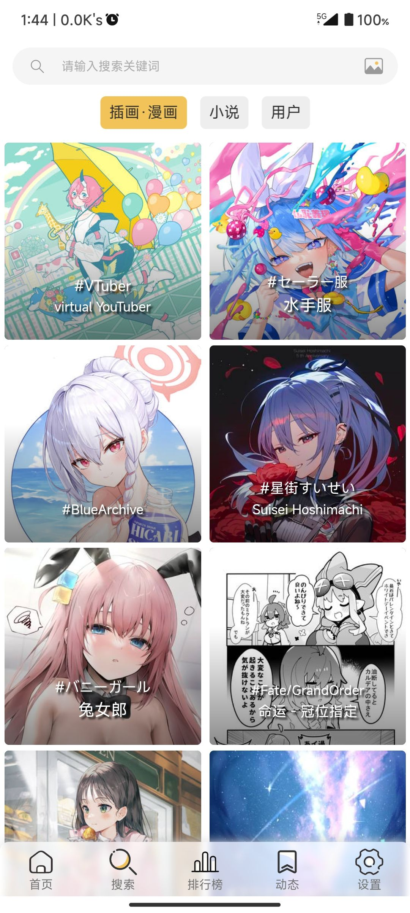</kbd>

<kbd>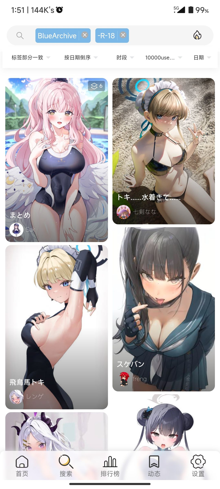</kbd>  <kbd>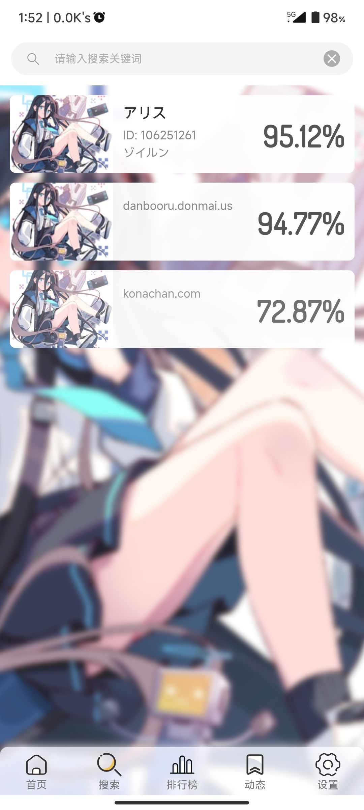</kbd>

<kbd></kbd>  <kbd>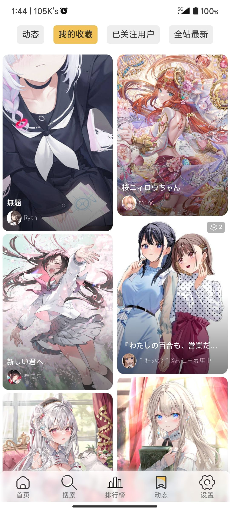</kbd>　

<kbd>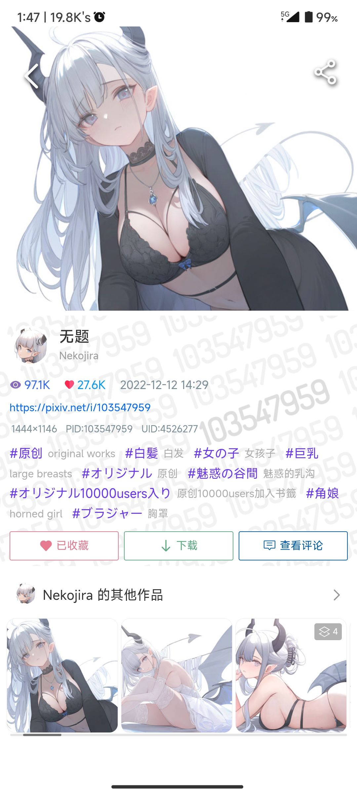</kbd>  <kbd>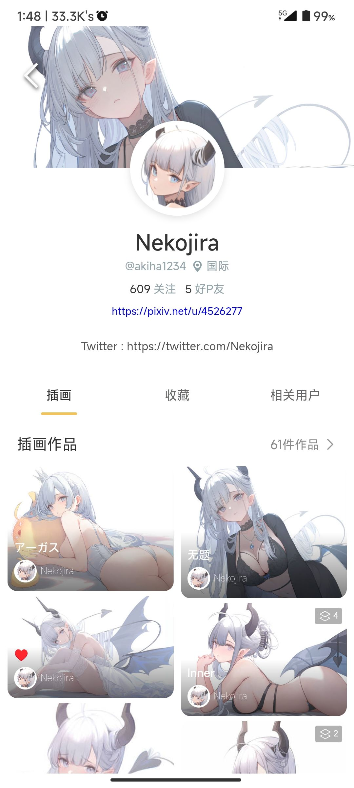</kbd>

- 桌面端

<kbd>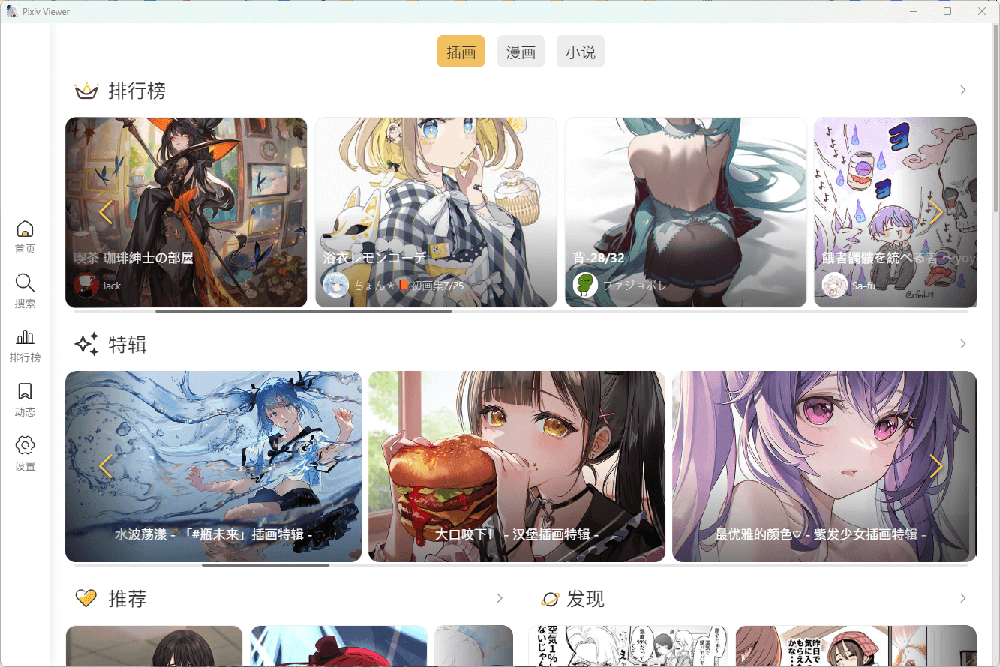</kbd>  <kbd>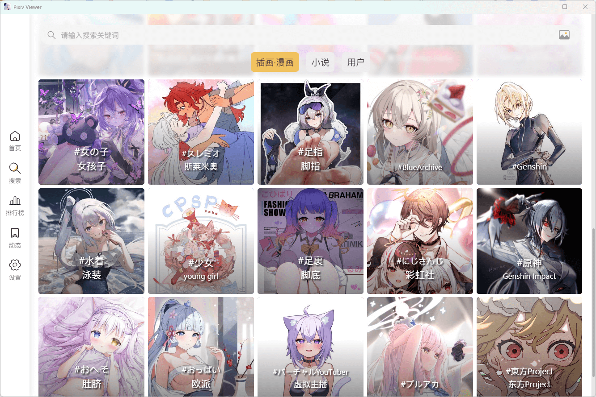</kbd>

<kbd>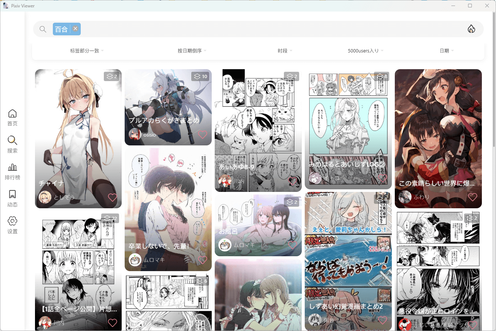</kbd>  <kbd>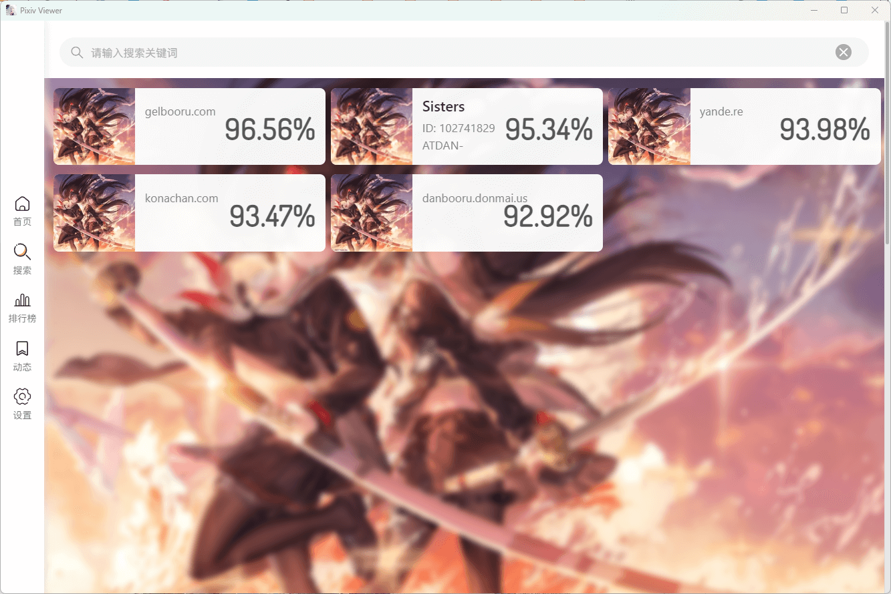</kbd>

<kbd>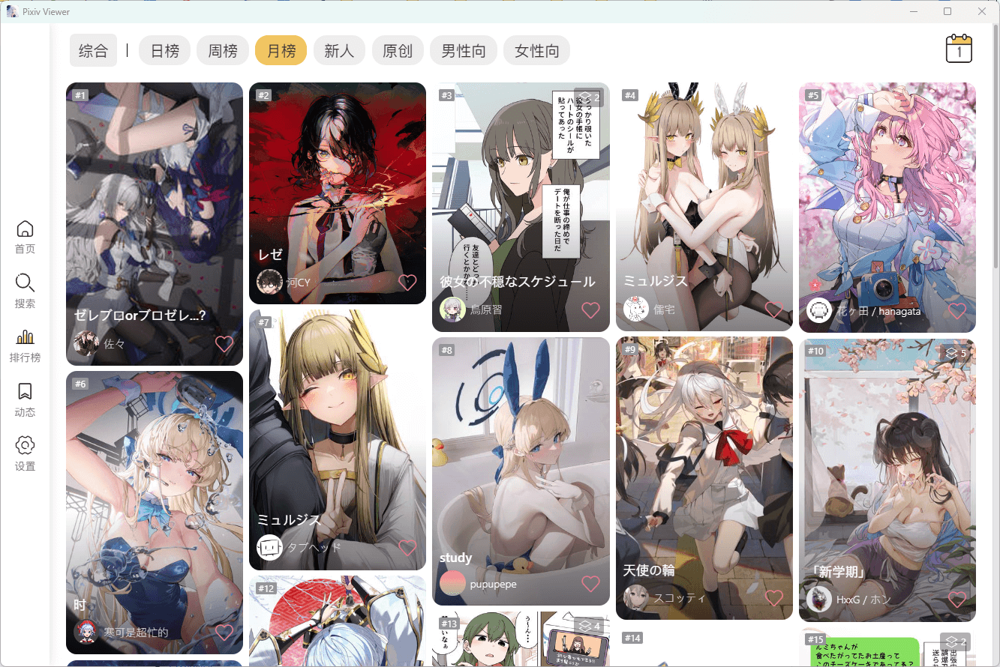</kbd>  <kbd>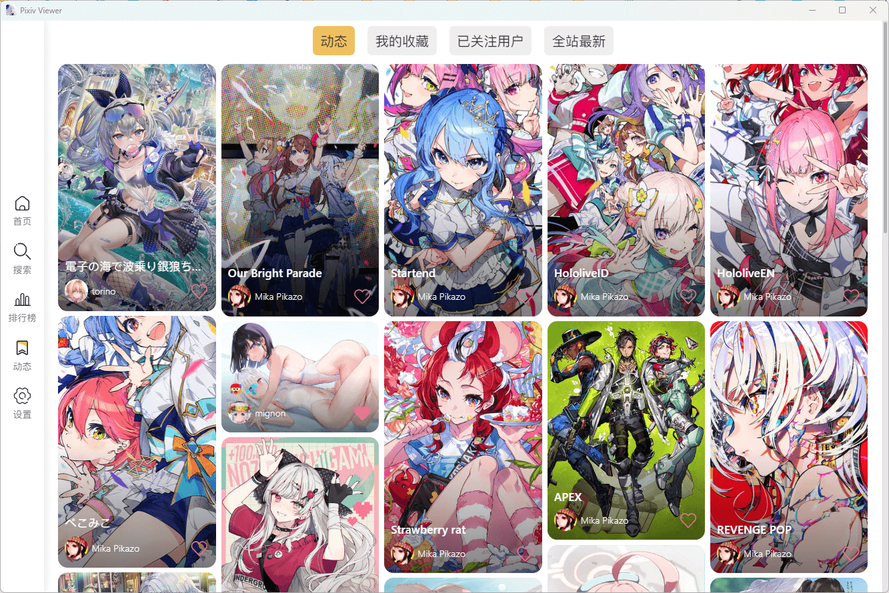</kbd>　

<kbd>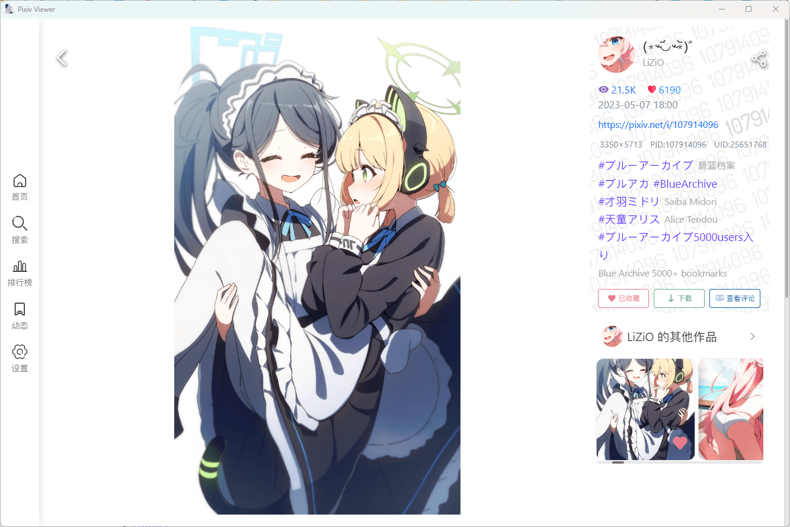</kbd>  <kbd></kbd>

## Alternatives

- [Pixiviz](https://z.pixiv.pics)
- [Pixivel](https://pxelk.pixiv.pics)
- [PixivNow](https://now.pixiv.pics/ranking)
- [PixivMoe](https://moe.pixiv.pics)
- [PixivLxns](https://lxns.pixiv.pics)
- [PIXID](https://pixid.top/ranking.php)
- [pixivic](https://pixivic.com)
- [vilipix](https://www.vilipix.com/ranking)
- [moeview](https://moeview.pixiv.pics)
- [booruwf](https://booru.pixiv.pics)
- [Ranking](https://www.nanoka.top/illust/pixiv/)

## Project setup
```
yarn install
```

### Compiles and hot-reloads for development
```
yarn serve
```

### Compiles and minifies for production
```
yarn build
```

### Lints and fixes files
```
yarn lint
```

### Customize configuration
See [Configuration Reference](https://cli.vuejs.org/config/).

## FAQ

### 自建的话如何预设图床与 API 实例

参照 [#2](https://github.com/asadahimeka/pixiv-viewer/issues/2) 与 [#5](https://github.com/asadahimeka/pixiv-viewer/issues/5) 设置环境变量。可以在项目根目录下新建 `.env` 文件，按如下格式填入环境变量：

```env
TEST="lalala"
ABC=DEF
```

### 一直提示 API 超限或者 Rate Limit

可以到设置里切换 API 实例，或者直接使用 RefreshToken 或者 OAuth 方式登录

### 如何获取 RefreshToken

参见 https://www.nanoka.top/posts/e78ef86/

### 图片加载很慢

受限于网络环境，图片加载速度可能会比较慢。可以到设置里切换图床，或者下载 Android 版本后打开图片直连功能

### Cookie/SessionID 登录出错

建议使用 RefreshToken 方式登录

### 是否有 iOS App

目前只有 Android 与 Windows 版本，均为 Webview 套壳，下载：[Releases](https://github.com/asadahimeka/pixiv-viewer/releases)

### Android 版本点击下载就闪退

到系统设置里给予本应用存储权限，或者下载最新版本后再进行尝试

## Contribute

本项目使用 [Vue I18n](https://kazupon.github.io/vue-i18n/) 进行国际化，其他语言翻译主要来自机器翻译，如有不妥，欢迎[贡献翻译](https://github.com/asadahimeka/pixiv-viewer/tree/master/src/locales)

## Credits
- [pixiv-viewer](https://github.com/journey-ad/pixiv-viewer)：原项目，修改于此
- [Vue](https://vuejs.org/)：前端框架
- [Vant UI](https://vant-ui.github.io/vant/v2/#/zh-CN/)：UI 组件库
- [Vue I18n](https://kazupon.github.io/vue-i18n/)：国际化支持
- [HibiAPI](https://api.obfs.dev/docs)：提供大部分接口支持
- [PixivNow](https://github.com/FreeNowOrg/PixivNow)：提供部分网页版接口支持
- [SauceNAO](https://saucenao.com/)：以图搜图功能接口
- [Cloudflare Workers](https://workers.cloudflare.com/)：图像反代服务
- [Vercel](https://vercel.com/)：提供页面托管服务

## LICENSE

[](https://github.com/asadahimeka/pixiv-viewer/blob/master/LICENSE)
