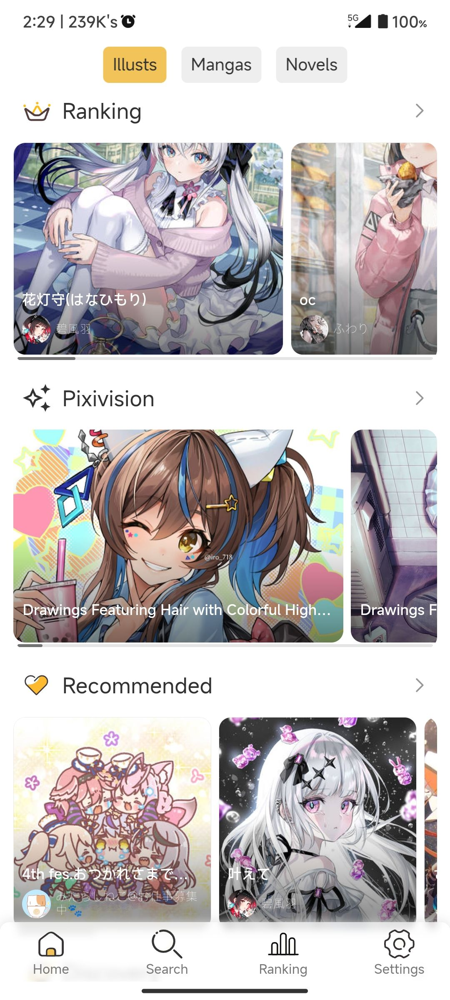
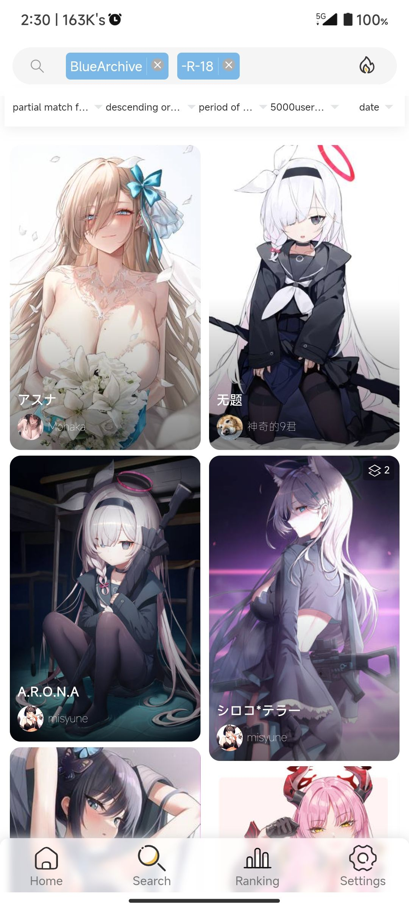
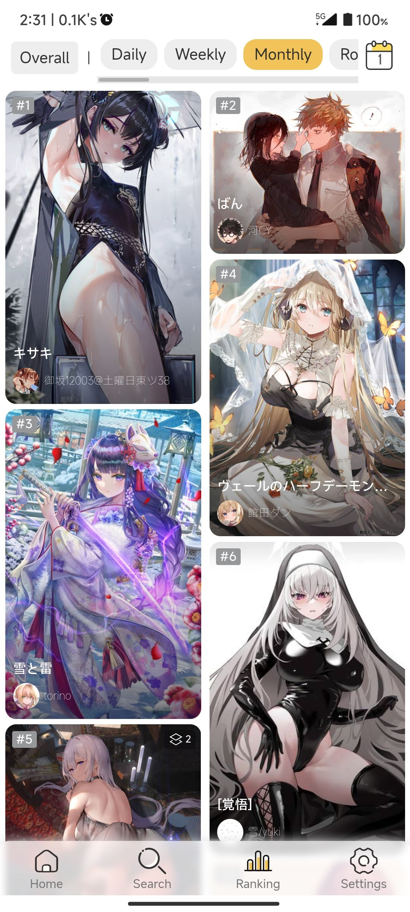
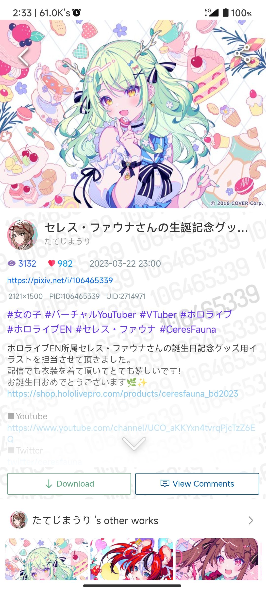
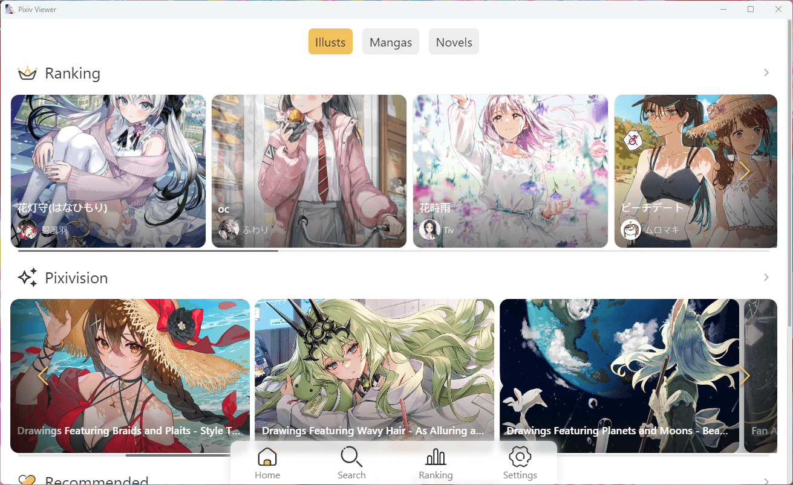
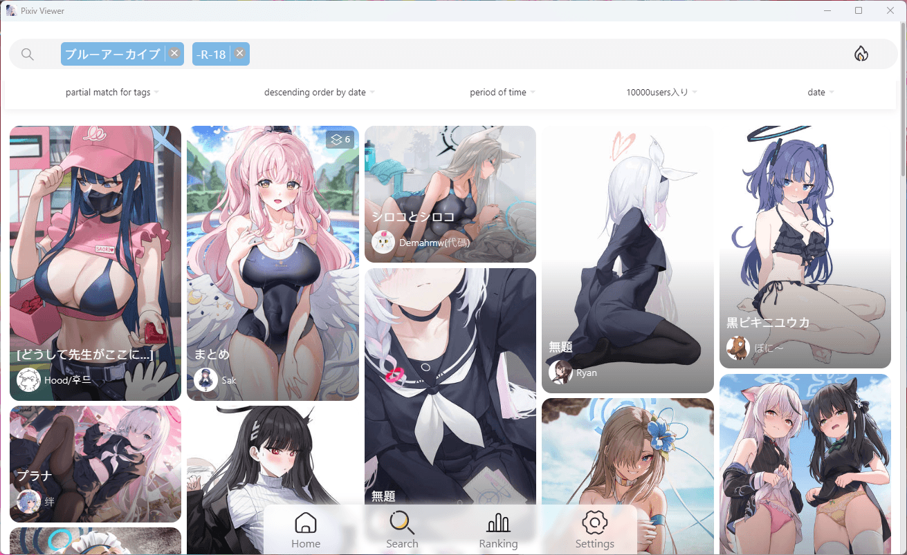
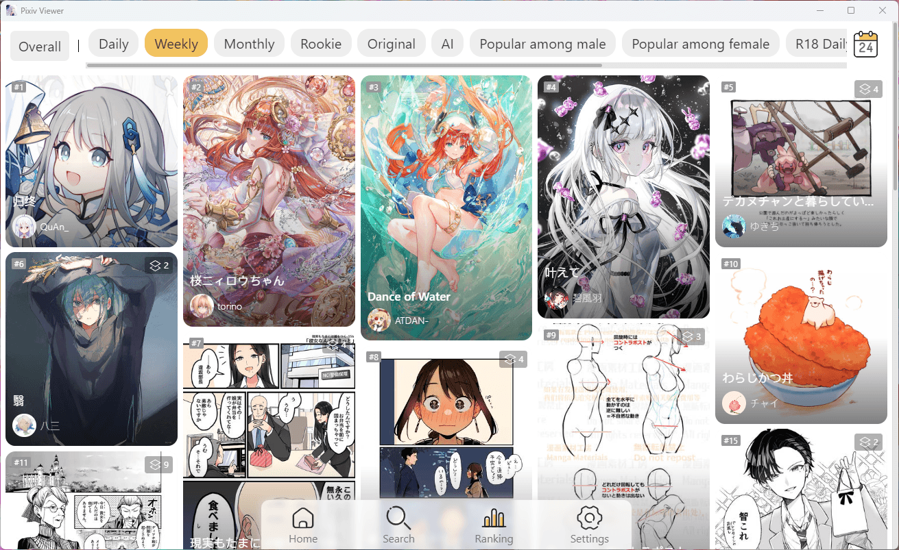
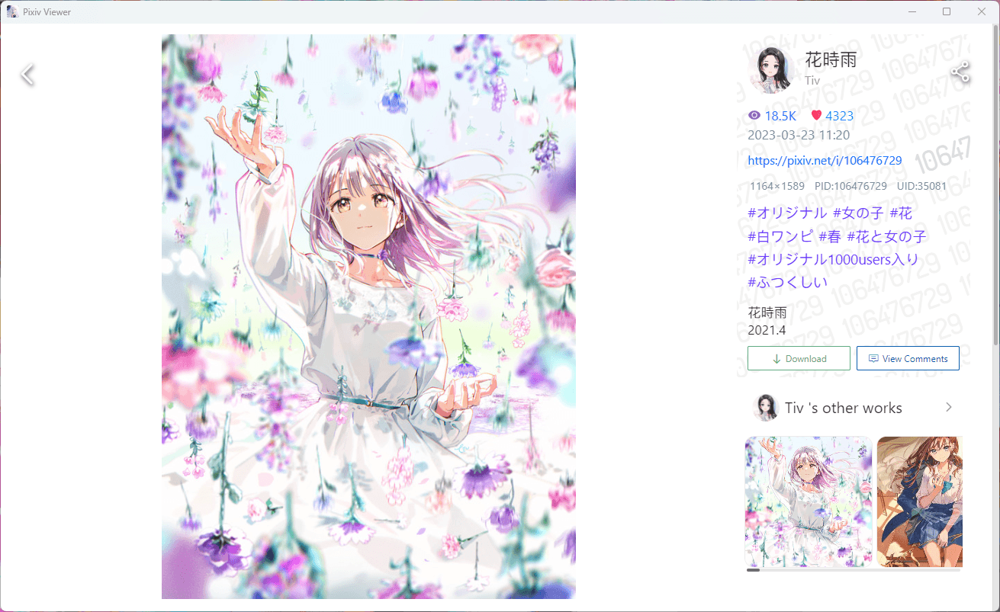

<p align="center"></p>

<h1 align="center">Pixiv Viewer <sup><small>Kai</small></sup></h1>
<p align="center">Yet Another Pixiv Illustration & Novel Viewer.</p>

<p align="center">


</p>

<p align="center">


</p>

**Demo:** 🔗 [pixiv.pictures](https://pixiv.pictures)

**Download:** ⏬ [GitHub Releases](https://github.com/asadahimeka/pixiv-viewer/releases)

## Features
- [x] Home
  - [x] Illustrations/Mangas/Novels/Live Streams
  - [x] Rankings/Spotlights/Recommended/Discover/New Artworks
  - [x] Random Artworks
- [x] Search (Illustrations·Mangas/Novels/Users)
  - [x] Search Trends (Long-press to view tag covers)
  - [x] Search Auto-complete
  - [x] Preview of Popular Artworks
  - [x] Search Params Support
  - [x] Image Search
- [x] Rankings
  - [x] Overall/Illustration/Manga/Ugoira/Novel Rankings
  - [x] R18/AI Rankings
  - [x] View Rankings by Date Range
- [x] Feeds
  - [x] Latest Artworks from Followed Users
  - [x] My Bookmarks
  - [x] Followed Users
  - [x] Latest from the Entire Site
- [x] Settings
  - [x] Login (RefreshToken/OAuth/Cookie)
  - [x] View History
  - [x] R18/G and AI Artwork Display Toggle
  - [x] Local Blacklist
  - [x] Clear Cache
  - [x] Multi-language Support
  - [x] Image Waterfall Layout Selection
  - [x] Image Detail Quality Selection
  - [x] Dark Mode
  - [x] App Theme Color
  - [x] Swipe Left/Right to Browse Artworks
  - [x] Multiple Image Proxy Options
  - [x] Multiple API Instance Options
  - [x] Export RefreshToken
  - [x] Proxy Service for AppAPI
  - [x] Long-press to Download Images from Lists
  - [x] Long-press to Block Images from Lists
  - [x] Download via File System Access API
  - [x] Download via Tampermonkey Userscript
  - [x] Customizable Download Filename Format
- [x] Artwork Detail Page
  - [x] Bookmark/Download/View Comments/Share
  - [x] Source Site Link
  - [x] Copy PID/UID
  - [x] Play Ugoira
  - [x] Download Ugoira (ZIP/GIF/WebM/APNG/MP4)
  - [x] Download Novels
  - [x] Novel Reading Settings (Font, Colors, Direction, etc.)
- [x] Author Detail Page
  - [x] Follow/Unfollow
  - [x] View Author's Illustrations/Mangas/Bookmarks/Novels
  - [x] View Manga/Novel Series
  - [x] Author's Illustration Tags
  - [x] Related Users

- [x] Local IndexedDB Cache Storage
- [x] Multi-platform Style Adaptation
- [x] PWA Support
- [x] Android/Windows Version
- [x] iOS/macOS Version

## Feedback

https://github.com/asadahimeka/pixiv-viewer/discussions

## Preview

- Mobile

<kbd></kbd>  <kbd></kbd>

<kbd></kbd>  <kbd></kbd>

- Desktop

<kbd></kbd>  <kbd></kbd>

<kbd></kbd>  <kbd></kbd>

## Alternatives

- [Pixiviz](https://pixiviz.cocomi.eu.org/)
- [Pixivel](https://pxelk.cocomi.eu.org/)
- [PixivNow](https://pxnow.cocomi.eu.org/)
- [PixivMoe](https://pixivmoe.cocomi.eu.org/)
- [PixivLxns](https://pixivlxns.cocomi.eu.org/)
- [pixivic](https://pixivic.com)
- [vilipix](https://www.vilipix.com/ranking)
- [moeview](https://moeview.cocomi.eu.org/)
- [booruwf](https://booru.cocomi.eu.org/)
- [RankTop50](https://www.nanoka.top/illust/pixiv/)

## Project Setup
```sh
pnpm install
```

### Compile and Hot-reload for Development
```sh
pnpm serve
```

### Compile and Minify for Production
```sh
pnpm build
```

### Lint and Fix Files
```sh
pnpm lint
```

### Customize Configuration
See [Configuration Reference](https://cli.vuejs.org/config/).

## Sponsor

If you find this project helpful, feel free to buy me a coffee:

[](https://ko-fi.com/sakurayumine)

## FAQ

### How to preset the image proxy and API instance if you build it yourself?

Refer to [#10](https://github.com/asadahimeka/pixiv-viewer/discussions/10) and [#13](https://github.com/asadahimeka/pixiv-viewer/discussions/13).
You can create a new `.env` file in the root directory of the project and fill in the environment variables in the format of `.env.example`.

### Why can't I view some artworks using a US/UK IP?

See the official pixiv announcement: https://www.pixiv.net/info.php?id=10837

It is recommended to log in to this site with your own account before using it, and select a non-US/UK region in the official web page [settings](https://www.pixiv.net/setting_user.php). It is best to select the Japan region.

### List and details do not match or repeat, search results do not match the search label

It is caused by the CDN cache of the self-built API, you can switch other API instances in the settings or use it after logging in.

### Keep prompting that the API exceeds the limit or Rate Limit

You can switch the API instance in the settings or log in directly using RefreshToken or OAuth.

### How to get RefreshToken

See https://www.nanoka.top/posts/e78ef86/

### Image loading is very slow

Image loading speed may be slow due to network conditions. You can switch to the image proxy in the settings, or download the Android version and turn on the image direct connection function.

### Cookie/SessionID login error

It is recommended to use RefreshToken to log in

### Is there an iOS App?

You can download it from [Github Releases](https://github.com/asadahimeka/pixiv-viewer/releases). Note that the iOS installation package is not signed, so you need to sign it yourself. Tutorials: [AltStore](https://faq.AltStore.io)

### Android version crashes after clicking download

Go to the system settings to give this application storage permissions, or download the latest version and try again.

## Contribute

This project uses [Vue I18n](https://kazupon.github.io/vue-i18n/) for translations. Non-Chinese language translations are mainly from machine translation, if you find errors, feel free to [contribute a translation](https://github.com/asadahimeka/pixiv-viewer/tree/master/src/locales).

## Credits

### Special Thanks
- [journey-ad/pixiv-viewer](https://github.com/journey-ad/pixiv-viewer)

### Contributors
- [@Blueberryy](https://github.com/Blueberryy): Russian translation
- [@olivertzeng](https://github.com/olivertzeng): Traditional Chinese translation

### Projects
- [HibiAPI](https://github.com/mixmoe/HibiAPI)
- [PixivNow](https://github.com/FreeNowOrg/PixivNow)

### Services
- [Pixiv.cat](https://pixiv.re/)
- [SauceNAO](https://saucenao.com/)
- [Cloudflare Workers](https://workers.cloudflare.com/)
- [Netlify](https://netlify.com/)

### Developing
- [Vue](https://vuejs.org/)
- [Vant UI](https://vant-ui.github.io/vant/v2/#/zh-CN/)
- [Vue I18n](https://kazupon.github.io/vue-i18n/)

## Disclaimer

This project has no affiliation with pixiv.net(ピクシブ株式会社).

All artwork copyrights in this project(Website/App) belong to Pixiv or their original authors.

This project is intended for communication and learning only and may not be used for any commercial purposes.

## LICENSE

[](https://github.com/asadahimeka/pixiv-viewer/blob/master/LICENSE)
